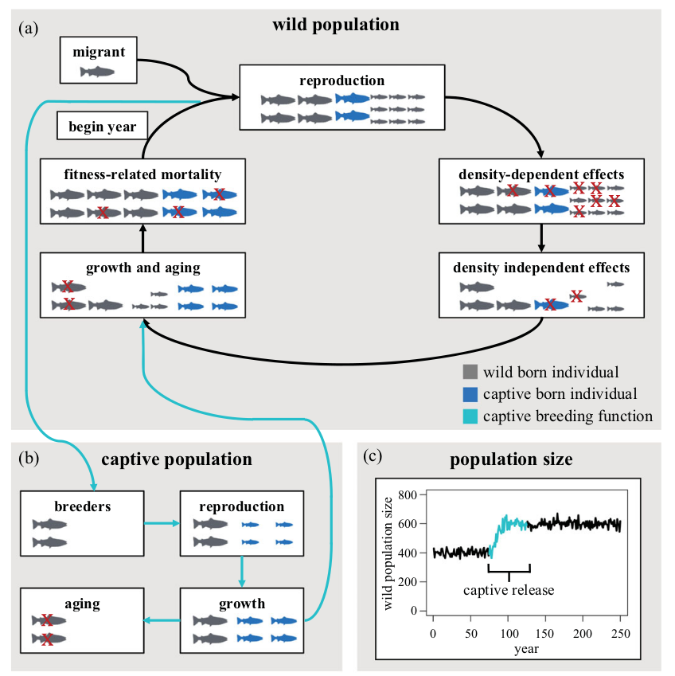

# Introduction

## Target Species - *Drymarchon couperi*

## Basis for Project

There are ongoing efforts to reintroduce the eastern indigo snake into Alabama, where it was extirpated nearly 60 years ago.
The Orianne Center for Indigo Conservation (OCIC) is spearheading efforts to breed individuals for release at Conecuh National Forest in southern Alabama, and Appalachicola Bluffs and Ravines in the Florida panhandle.
** This project will use simulated data to understand the longterm impact of introducing captive bred individuals with small amounts of genetic adaptation to captivity into wild populations. Estimated model parameters include population fitness, neutral genetic diversity, and population size.**
In addition to estimating these parameters for the reintroduced populations, I will estimate the effects of using captive bred individuals to supplement declining wild populations.

# The Model

The simulation code was developed and described in Willoughby et al. (2019) and was forked on Github from jwillou/captivebreeding-IBM

## Parameters

# Goals

This project seeks to accomplish the following goals:

- Modify existing code from Willoughby so that it applies to eastern indigo snake 
- Model the effects of introducing captive bred individuals into the re-introduced populations
- Model the effects of introducing captive bred individuals into established wild populations
- 

### Original README from jwillou/captivebreeding-IBM

Code for modeling effects of releaseing captive-born individuals into wild populations associated with the publication Willoughby JR, Christie MR. 2019. Long‐term demographic and genetic effects of releasing captive‐born individuals into the wild Conservation Biology https://onlinelibrary.wiley.com/doi/pdf/10.1111/cobi.13217

Also found at https://github.rcac.purdue.edu/MarkRChristieGroup/captivebreeding-IBM

More information availalbe at lab wiki: https://wiki.itap.purdue.edu/pages/viewpage.action?pageId=82912459.

Note: Use of the provided code requires a specific configuration of folders. Within the directory holding all of the provided scripts, there should be three folders:source, plot, and output. All .R files that execute the simulation, except for RRSmodel.R, are found in source into the 'source' directory. After defining parameter values within RRSmodel.R and running the code, all output files will be directed into the 'output' directory. All code for plotting and parsing the output are found in the plot directory.